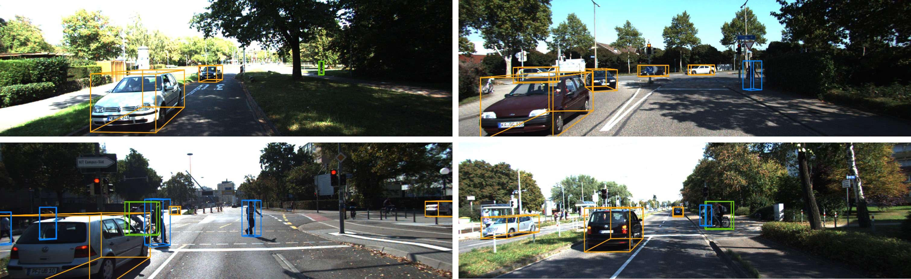

# MonoDTR

**MonoDTR: Monocular 3D Object Detection with Depth-Aware Transformer** (CVPR 2022) [[paper](https://arxiv.org/abs/2203.10981)]\
Kuan-Chih Huang, Tsung-Han Wu, Hung-Ting Su, Winston H. Hsu.



## Setup

Please refer to [INSTALL.md](INSTALL.md) for installation and to [DATA.md](DATA.md) for data preparation.


## Train

Move to root and train the network with `$EXP_NAME`:

```sh
 ./launchers/train.sh config/config.py 0 $EXP_NAME
```

Note: this repo only supports single GPU training. Also, the training randomness for monocular 3D object detection may cause the variance of ±1 AP3D.

## Eval


To evaluate on the validation set using checkpoint `$CHECKPOINT_PATH`:

```sh
 ./launchers/eval.sh config/config.py 0 workdirs/MonoDTR/checkpoint/MonoDTR.pth validation
```

We provide a good checkpoint for the car category on train/val split [here](https://drive.google.com/file/d/1mQzqjnosra5JE1sJKzSRzdn3R010G0Gh/view?usp=sharing).

## Citation

If you find our work useful in your research, please consider citing:

```
@inproceedings{huang2022monodtr,
    author = {Kuan-Chih Huang and Tsung-Han Wu and Hung-Ting Su and Winston H. Hsu},
    title = {MonoDTR: Monocular 3D Object Detection with Depth-Aware Transformer},
    booktitle = {CVPR},
    year = {2022}    
}
 ```

## Acknowlegment

Our codes are mainly based on [visualDet3D](https://github.com/Owen-Liuyuxuan/visualDet3D), and also benefits from [CaDDN](https://github.com/TRAILab/CaDDN), [MonoDLE](https://github.com/xinzhuma/monodle), and [LoFTR](https://github.com/zju3dv/LoFTR). Thanks for their contributions!

## License

This project is released under the MIT License.

